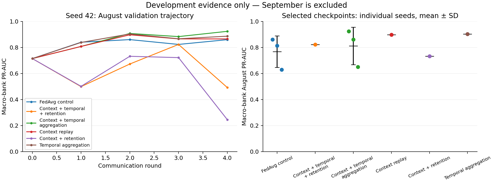

# Adaptive continual and federated learning: completed results

Completed 24 September 2026. The selected federated method achieves **0.8710 ± 0.0611 September PR-AUC**, compared with the historical frozen model's **0.7590 ± 0.0360** and a matched ordinary-FedAvg continuation control's **0.7872 ± 0.1278**. Context replay also improves standalone continual learning. These are measured results across seeds 42, 52, and 62, not targets or simulated estimates.

**September results are exploratory.** This period was already examined in the project's history. All new configuration and checkpoint selection used August; both final comparisons were hash-frozen before this new September evaluation. No method was tuned after viewing these scores. A later, untouched time period is needed for a confirmatory claim.

## Main comparison

PR-AUC means sklearn average precision. Each seed averages the three banks equally; the table then reports the mean and sample standard deviation across seeds. It is not pooled transaction-level AP and the ± values are not confidence intervals.

| Method | August validation PR-AUC | September PR-AUC |
|---|---:|---:|
| Historical frozen CL | 0.5987 ± 0.0383 | 0.5815 ± 0.0157 |
| Matched rerun CL, uniform replay | 0.5214 ± 0.0552 | 0.5339 ± 0.0338 |
| **CL, risk and account-context replay** | **0.6326 ± 0.0446** | **0.6656 ± 0.0599** |
| Historical frozen FedAvg + CL | 0.7083 ± 0.0937 | 0.7590 ± 0.0360 |
| Matched FedAvg continuation | 0.7673 ± 0.1216 | 0.7872 ± 0.1278 |
| **Context replay + temporal harmonization** | **0.8114 ± 0.1432** | **0.8710 ± 0.0611** |

The federated gain over the historical model is **+0.1120 absolute PR-AUC (11.2 percentage points)**. Extra training contributes to this comparison: both new federated variants start from the actual seed-specific historical checkpoint and receive four additional communication rounds. The controlled method gain over the same-budget continuation is **+0.0838** on September and **+0.0441** on August. The architecture, optimizer, local task epochs, and 2,000-event replay capacity are matched. Context scoring/selection adds computation, so the comparison matches training updates and rounds rather than exact wall-clock cost.

Standalone context replay improves September AP by **+0.1316** over its matched CL baseline and **+0.0841** over historical CL. Changes in runtime, RNG handling, and the calendar boundary make the rerun baseline the appropriate causal comparison.

## What changed

1. **Continual learning: risk and account-context replay.** Keep rare historical positives, high-scoring historical negatives, strictly earlier transactions sharing their accounts, and uniform coverage. The memory stays at 2,000 events. Selection uses completed June history only; July is learned with chronological replay. This tests whether preserving relevant temporal context is more useful than uniform memory alone.
2. **Federated learning: temporal update harmonization.** Cap each client's temporal update norm at twice the client median and partially remove conflicting peer directions from time/message/GRU updates. Use original peer directions and averaged corrections to make the result independent of client order. Static, edge, and decoder parameters retain uniform FedAvg. No replay events are sent to the server.

The selected combination uses **no logit distillation**. Distillation was tested and generally harmed validation performance. The contribution is this AML-specific replay and temporal-parameter combination and its ablations, not a claim that replay or gradient conflict projection is newly invented. See [method definitions and primary references](ADAPTIVE_FCL_RESEARCH.md).

## Seed-level results

| Seed | FedAvg continuation August | New FCL August | FedAvg continuation September | New FCL September | September paired gain |
|---|---:|---:|---:|---:|---:|
| 42 | 0.8599 | 0.9234 | 0.8894 | 0.9316 | +0.0422 |
| 52 | 0.8126 | 0.8607 | 0.8283 | 0.8719 | +0.0436 |
| 62 | 0.6296 | 0.6501 | 0.6439 | 0.8094 | +0.1656 |

The new FCL checkpoints were selected at additional rounds 4, 3, and 2 respectively using August alone. All three seeds improve against the matched control on both periods. Seed 62 still has substantially weaker validation performance, so the mean should not hide run variability. We retain all three checkpoints and do not select a deployment seed from September scores.

| Seed | Uniform CL September | Context replay CL September | Paired gain |
|---|---:|---:|---:|
| 42 | 0.5074 | 0.5985 | +0.0911 |
| 52 | 0.5224 | 0.7138 | +0.1914 |
| 62 | 0.5720 | 0.6844 | +0.1124 |

## Bank and alert-budget diagnostics

September AP, averaged across seeds:

| Bank | FedAvg continuation | New FCL | Uniform CL | Context CL |
|---|---:|---:|---:|---:|
| JPMorgan Chase | 0.8021 | 0.9217 | 0.4481 | 0.7297 |
| Wells Fargo | 0.8646 | 0.9547 | 0.5861 | 0.6086 |
| Key Bank | 0.6949 | 0.7365 | 0.5676 | 0.6584 |

At 25 alerts **per bank for the entire September split**, macro recall improves from **0.6996 to 0.7883** and precision from **0.7600 to 0.8400** for FCL. For CL, recall improves from **0.4943 to 0.6049** and precision from **0.5467 to 0.6489**. These are ranking metrics; operational probability calibration and alert-policy validation remain separate. They are not 25 daily alerts or a pooled cross-bank budget.

## Ablations and negative results

The warm-start seed-42 August screen, with four additional rounds for every variant:

| Variant | Best August PR-AUC |
|---|---:|
| Uniform FedAvg continuation | 0.8599 |
| Context replay only | 0.8968 |
| Context replay + logit retention | 0.7317 |
| Temporal harmonization only | 0.9034 |
| Context + harmonization + retention | 0.8227 |
| Context + harmonization, no retention | 0.9234 |

The no-retention combination was added as an explicitly documented adaptive follow-up after the initial five variants showed retention was harmful. It was added before confirmation on seeds 52 and 62. This was not an entirely preregistered search. Only the selected combination and matched control received three-seed warm-start confirmation; the individual-component ablations are single-seed evidence.

A separate 16-round **from-scratch** study also supports context replay: August AP rises from **0.7492 ± 0.1118 to 0.8331 ± 0.0704**, with gains on all three seeds. Temporal harmonization alone did not beat its scratch baseline at seed 42. It should therefore be described as a useful continuation method in this experiment, not universally better aggregation. Scratch checkpoints were not added to September comparisons after the frozen evaluation plan.

For standalone CL, context replay raises August AP from **0.5214 to 0.6326**. The retention variant averages **0.5208** and does not improve the baseline. June before/after-July AP is measured on June training events: mean before-minus-after is -0.1310 for uniform replay and -0.2443 for context replay. These negative values show improved in-sample June ranking, not a held-out demonstration that catastrophic forgetting is solved.

The initial per-client-RNG diagnostic produced a weak baseline and is preserved separately. The main experiments restore global RNG behavior and use a matched control. A regression test verifies that uniform-replay client updates reproduce the original core trainer under matched boundaries. The new calendar boundary is July 1 midnight; the old first-event-plus-30-days rule misassigned one JPMorgan event.



## Reproduction and artifacts

- Implementation: [`adaptive_continual_federated.py`](../src/gnn/adaptive_continual_federated.py).
- Selected warm-start settings: [`adaptive_fcl_warm_refined.json`](../configs/adaptive_fcl_warm_refined.json), variant `context_harmonized`.
- Standalone CL settings: [`adaptive_cl_context.json`](../configs/adaptive_cl_context.json), variant `context_replay`.
- FCL checkpoint/metric hashes: [`EXPLORATORY_FREEZE.json`](../artifacts/research_adaptive_fcl/warm_start/EXPLORATORY_FREEZE.json).
- CL checkpoint/metric hashes: [`LOCAL_EXPLORATORY_FREEZE.json`](../artifacts/research_adaptive_fcl/global_rng/LOCAL_EXPLORATORY_FREEZE.json).
- Full FCL evaluation: [`summary.json`](../artifacts/research_adaptive_fcl/warm_start/exploratory_september/summary.json), with adjacent per-seed reports.
- Full CL evaluation: [`summary.json`](../artifacts/research_adaptive_fcl/global_rng/local_exploratory_september/summary.json), with adjacent per-seed reports.
- All August ablations: [warm-start results](../artifacts/research_adaptive_fcl/warm_start/RESULTS.md) and [scratch/local results](../artifacts/research_adaptive_fcl/global_rng/RESULTS.md).

Selected FCL checkpoint paths are `artifacts/research_adaptive_fcl/warm_start/federated/context_harmonized/seed_{42,52,62}/global_model.pt`. CL stores one checkpoint per bank under `artifacts/research_adaptive_fcl/global_rng/local/context_replay/seed_{42,52,62}/`. These are separate from the original frozen artifacts.

Example: reproduce seed 42 in a **new output directory**, using the already selected settings:

```bash
python3 -B src/gnn/adaptive_continual_federated.py \
  --mode federated --seed 42 --rng-policy global --threads 1 \
  --rounds 4 --local-epochs 3 --replay-size 2000 \
  --replay risk_context --aggregation temporal_harmonized --distill 0 \
  --initial-checkpoint artifacts/final_evaluation/corrected_fedavg/seed_42/global_model.pt \
  --output-dir artifacts/research_adaptive_fcl/reproduction_seed42
```

The validation-only runner never loads September. The separate evaluator requires an explicit exploratory acknowledgement, verifies frozen checkpoint/metric hashes and development-data fingerprints, and refuses an existing output directory. Run manifests record source snapshots, data fingerprints, configuration, and runtime versions. All 12 reloaded model/seed evaluations reproduce their saved August AP to floating-point precision.

Validation: **24 tests pass**, including chronological replay and capacity bounds, strictly earlier account context, temporal aggregation invariance, matched uniform client updates, distillation isolation, exact threshold-search equivalence, validation-only loading, and freeze/evaluation guards. No original model implementation, dataset content, frozen checkpoint, or final evaluation report was overwritten.

## Limits on the claim

This is a three-bank, two-training-task experiment with only 59 August positives. August guided an adaptive search and September was previously inspected. Three seeds show sensitivity but do not establish statistical significance or generalization across datasets. Fixed-budget replay and useful context are supported here; task-free continual learning and general long-horizon forgetting are not established. Shared training-only feature encoding follows the existing simulator and is not a private preprocessing protocol. No differential privacy or secure aggregation guarantee is added.

The new methods are implemented and tested in the research simulator. They have not been integrated into or deployed through the older Kafka worker. The next confirmatory study should lock this implementation and evaluate a later unseen period, ideally with more banks and longer task sequences, before replacing paper headline claims with a definitive generalization result.
