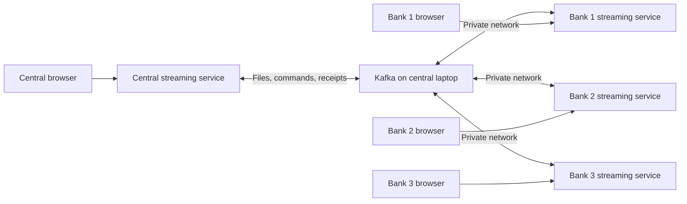

# Model-weight streaming blueprint

Status: planned; documentation only. Updated: 2026-09-22.
Baseline inspected: `1294588780ddef3512910accce3b0fc48ee655f4`.

## 1. Objective and scope

Provide a browser interface for transferring existing model-weight files between a central laptop and bank laptops. After initial machine setup, users open a launcher, check connections, select a file, and start a transfer. Routine operation must not require copying terminal commands.

**Training is outside this project phase.** Do not start or modify the aggregator, bank training worker, model code, datasets, feature encoders, hyperparameters, replay, FedAvg, evaluation, or frozen results. A transfer is not a training round. Bank identities are transport identities; they do not select datasets.

The application transfers existing files as opaque bytes. It must not call `torch.load`, unpickle a checkpoint, instantiate a model, convert weights, or claim that successful delivery proves model compatibility. Existing `.pt`, `.pth`, and `.safetensors` files can be transported without interpreting their contents.

The first release supports:

- Central sending a selected file to the configured banks.
- A bank sending a selected file back to central, without aggregation.
- Connection checks, automatic receiver startup, visible progress, verified saving, transfer history, cancellation, and explicit retries.
- Windows and macOS laptops, with an optional Linux development environment.

## 2. What exists and what must be built

| Component | Current evidence | Planned use |
|---|---|---|
| `distributed_federation/common/protocol.py` | JSON envelopes, Base64 chunks, HMAC-SHA256, payload SHA-256, out-of-order assembly and duplicate checks | Reuse through a streaming adapter; preserve existing training protocol behavior |
| `distributed_federation/common/kafka_io.py` | Producer delivery callbacks, idempotent producer configuration, manual consumer commits | Reuse transport primitives; expose structured progress through a separate adapter |
| `distributed_federation/tools/weight_smoke_test.py` | Central-to-bank file-byte transfer without model loading | Reference behavior for the new service; not a complete dashboard backend |
| `distributed_federation/kafka/compose.yaml` | Existing Kafka infrastructure | Reference for a separate streaming Compose deployment |
| Existing preflight | Checks intended for the federation runtime | Build a streaming-only check path with no dataset or model dependencies |
| Dashboard, launchers, receipts, persistent downloads | Not implemented in the inspected baseline | New work |

The smoke-test receiver currently reconstructs bytes, checks the hash and size, prints success, and exits. It does **not** save those bytes to a file or send central a receipt. Producer delivery confirms broker acceptance, not that a bank received and saved the file.

No dashboard, image, launcher, or automated cross-platform deployment is delivered by this blueprint.

## 3. Target user journey

### First use on each laptop

1. Install and start Docker Desktop with Linux containers. Install ZeroTier on the host, join the team network, and have the network owner authorize the laptop.
2. Clone the repository and open the platform launcher.
3. Choose Central or Bank. Enter the central host's reachable private address; banks also enter their assigned client ID.
4. Central creates a team configuration and per-bank enrollment packages. Each bank imports only its own package through its local dashboard. Packages contain credentials and must be shared privately.
5. Save configuration, then run Check connections. The dashboard explains any failure and the required action.
6. Select an existing weight file using a browser file picker. No dataset is needed.

Docker installation, virtualization enablement, network authorization, OS firewall permissions, and first-launch OS trust prompts may require a person. The app guides those steps; it does not silently change host security settings.

### Normal use

Open launcher → dashboard → Check connections → select file → Start transfer → verify recipient completion → download received file or view history.

Receivers start with their local application. Teammates do not open separate sender/receiver terminals. Each laptop must be awake with its application running. Closing a browser tab does not stop an active transfer.

## 4. Deployment and networking

Use a small Python/FastAPI service with plain HTML, CSS, and JavaScript. Each machine serves its own dashboard on a loopback-only host port. Server-sent events or polling expose structured status. SQLite and a persistent file directory are sufficient; no separate database server is needed.

| Machine | Containers | Persistent contents |
|---|---|---|
| Central | Streaming service; Kafka in KRaft mode; idempotent topic initializer | Settings, credentials, transfer history, sent/received files, Kafka data |
| Bank | Streaming service | Settings, its own credentials, transfer history, sent/received files |

The host launcher owns Docker Compose startup, readiness waiting, diagnostics, and browser opening. The web service does not receive the Docker socket. Central startup must support a setup-only dashboard before Kafka is configured: the host launcher reads saved settings and starts Kafka once the central address is available. Address changes require a guided service restart.

Use published ports and a normal Compose bridge network; do not depend on host networking. Containers on central use Kafka's internal listener. Remote banks bootstrap through the central host's private address and published Kafka port. Kafka must advertise that same reachable external address to them; advertising `localhost` or a Compose service name to remote banks will fail.

ZeroTier runs on the host. Verify routing from inside the bank containers, not just host-to-host ping. Restrict the published broker port to the intended private network using a supported host binding/firewall arrangement, and test that arrangement on both platforms. Do not expose dashboards or the broker through public router port forwarding.

Target native `linux/amd64` images for Windows Intel/AMD and Intel Macs, and `linux/arm64` images for Apple Silicon. Validate the chosen Kafka image and Python dependencies on both architectures before promising support. Windows ARM is outside the first acceptance matrix. No GPU or ML runtime is required for byte transfers.

Docker Desktop manages virtualization internally; this removes the team's manually administered Ubuntu VMs, not virtualization itself.

Start with reproducible local image builds. Publish versioned multi-architecture images only after validation and an explicit release decision. Pin tested dependencies/image versions at implementation time; record the application version and protocol version in each transfer manifest.

## 5. Transfer architecture



Use dedicated streaming topics so this application cannot trigger training consumers:

| Proposed topic | Purpose |
|---|---|
| `fcl.streaming.downstream` | Central file chunks for banks |
| `fcl.streaming.upstream` | Bank file chunks for central |
| `fcl.streaming.control` | Transfer announcements, readiness challenges, cancellation |
| `fcl.streaming.events` | Authenticated readiness, progress, completion receipts, errors |

Keep `fcl.global-model` and `fcl.client-updates` and their training consumers unchanged. Use distinct streaming message types. Where the existing chunk envelope requires `run_id`, map it to the transfer-attempt ID and fix `round_id` to zero; use explicit transport-only schema metadata rather than inventing a model schema.

Every bank uses a separate consumer group to receive the full central transfer. Central consumes upstream files and events. A single backend worker owns each local consumer; browser refreshes must not create additional Kafka consumers.

Transfer metadata includes a generated transfer ID, attempt ID, sender, intended recipients, safe display filename, byte count, SHA-256, chunk count, application/protocol versions, and creation time. Freeze the uploaded source in managed storage before hashing/sending so edits to the original file cannot change a transfer midway.

### Delivery sequence

1. Validate settings, input size, storage capacity, recipient identity, and connectivity.
2. Announce the transfer; wait for authenticated readiness from intended recipients within a bounded timeout.
3. Chunk and sign the frozen file. Report broker-acknowledged chunks separately from receiver progress.
4. Recipients verify signatures and transfer metadata, deduplicate chunks, reconstruct bytes, and verify the complete hash and byte count.
5. Write to a temporary file inside the managed receive directory; atomically rename only after successful verification. Never overwrite an unrelated existing file.
6. Persist a receipt containing recipient, attempt ID, payload hash, saved byte count, and status. Only then report Saved and verified.
7. Publish the authenticated receipt and retry its delivery if necessary. Central marks the transfer Complete only after every intended recipient has a matching receipt.

A transfer that reaches the broker but lacks a receipt remains Awaiting confirmation or Timed out. It must never appear as successful end-to-end delivery.

## 6. Dashboard

| Screen | Controls and evidence |
|---|---|
| Setup | Role, client ID/display name, broker address, private enrollment import, storage status |
| Connections | Kafka metadata reachability, expected topics, authenticated peer readiness, last seen, app/protocol compatibility |
| Transfer | File picker, file size/hash, recipient list, Start transfer and Cancel |
| Live progress | Per-recipient verified chunks/bytes, receiving/verifying/saving states, elapsed time, receipt status |
| History | Sender, recipients, filename, hash, outcome, attempts, timestamps, local download |
| Diagnostics | Plain-language error, recommended action, expandable redacted logs, exportable diagnostic report |

Use actual counts rather than animated estimates. Distinguish upload-to-local-app progress, broker publication, remote receipt, and saved-file completion. Show stale peer information with its timestamp. Do not show training losses, epochs, aggregation, fraud scores, or model evaluation metrics.

On a bank dashboard, Send to central is a file-transfer action. Central's dashboard displays the received file without loading or combining it.

## 7. Checks and failure behavior

Check connections should report each check independently:

- Host launcher: Docker daemon, Compose availability, image architecture, ports, available storage, and service readiness.
- Service: valid configuration, unique known client identity, writable persistent storage, allowed file size, Kafka metadata and advertised-address reachability.
- Peer handshake: fresh signed challenge/response proving that both sides can communicate with the configured credentials. Secret presence or length alone is insufficient.
- Transfer gate: selected recipients are ready, source is frozen, expected limits agree, and destination has sufficient space.

Suggested recipient states: Pending → Ready → Receiving → Verifying → Saving → Complete. Terminal alternatives: Failed, Timed out, Cancelled, Interrupted. Record publication and recipient states separately.

Retries resend the whole file with a new attempt ID linked to the original transfer. Partial byte resume is deferred. Already completed recipients remain visible; a retry can target only failed recipients. Duplicate messages and receipts must be harmless. Reject stale attempts and expired control messages.

After a process restart, restore history and mark unfinished attempts Interrupted. Reconcile receipts for files already saved before offering a resend. Use persistent receipt/outbox records so a crash between saving and notification cannot silently lose completion evidence. Do not claim Kafka provides end-to-end exactly-once file delivery.

Cancellation stops further sending and requests receivers discard that attempt's partial data. It cannot retract already published Kafka messages or delete completed files on another laptop. Preserve completed receipts and label partial completion honestly.

Normal shutdown/restart preserves volumes, keys, history, and received files. Changing broker address or credentials is an explicit settings operation; rebooting must not rotate keys. Use bounded retry/backoff, file-size limits, chunk-count limits, per-peer pending-transfer limits, and cleanup of expired partial files. Initial payload ceiling: no higher than the existing assembler's 100,000,000-byte limit; enforce it before upload and at every receiver.

## 8. Credentials and files

Retain the prototype's HMAC/hash approach and private-network trust model. Central has the central signing secret and per-bank secrets; each bank gets the central verification secret and its own secret. Use bank-specific credentials for readiness and receipts. Sign all control/event records, validate identity and freshness, and redact credentials from logs and diagnostic exports.

A shared central HMAC secret authenticates membership in the trusted team; any holder can also forge a central signature. HMAC does not encrypt payloads. Logical recipients and topic names are not access-control boundaries, and bank files should not be described as confidential from other trusted broker participants. Broker ACLs/TLS or asymmetric signatures are separate future hardening work, not claims of this release.

Use backend-managed file IDs, generated storage names, and path containment checks. Never trust a sender-supplied path. Keep uploads and received files away from source code and frozen artifacts. Bound upload size and aggregate disk usage. Downloads are served only through the local application.

Keep credentials outside Git and images. Protect the loopback web API with a local session token and same-origin/CSRF checks for mutations; do not provide arbitrary shell execution endpoints. Enrollment export is per bank and must not reveal other bank secrets. The UI masks keys after entry.

## 9. Proposed implementation surface

All names below are proposed, not existing entry points:

```text
streaming/
  app/                 API, background transfer service, event handling
  web/                 Static dashboard
  config/              Non-secret example settings and validation schema
  Dockerfile
  compose.yaml         Central/bank service definitions
  requirements.txt     Streaming dependencies only
launchers/
  Start-Streaming.cmd
  Start-Streaming.ps1
  Start-Streaming.command
tests/streaming/        Transport, persistence, API, and integration checks
docs/STREAMING_BLUEPRINT.md
```

Keep machine settings, credentials, SQLite state, and file storage in ignored local storage or persistent Docker volumes. Avoid importing the federation configuration/model runtime just to move bytes. Preserve the existing training code and configuration. Any adapter change to shared transport helpers must keep their old API working and have regression coverage.

Windows and macOS launchers should resolve their own directory, handle spaces/non-ASCII paths, reuse an existing service, and open the dashboard after readiness. macOS execution permissions and OS trust prompts require explicit packaging tests; no bypass of OS protections. Developer CLI fallback may exist, but routine user documentation should describe UI actions.

## 10. Milestones and acceptance gates

| Milestone | Deliverable | Gate |
|---|---|---|
| 0 — Blueprint | Scope, architecture, documentation consolidation | This document reviewed; no runtime changes |
| 1 — Transport service | Standalone bidirectional byte transfers, persistence, receipts | Hash-identical saved files; no ML imports or execution |
| 2 — Containers and checks | Central/bank Compose deployment, enrollment, readiness checks | One central and three logical banks pass locally; failure diagnostics work |
| 3 — Dashboard | Setup, transfer, live status, history, cancellation/retry | Entire normal workflow works without typed commands |
| 4 — Platform launchers | Windows and macOS launch flows | Fresh-host checklist passes on both target architectures |
| 5 — Team demonstration | Real multi-laptop exchange | Three banks receive; each can return a file; restart and failure tests pass |

Acceptance must include a small file and a multi-chunk weight file; wrong credentials; missing broker; unreachable advertised listener; offline recipient; corrupted/conflicting/duplicate/out-of-order chunks; stale attempts; interrupted transfer; disk write failure; and a crash after saving but before receipt delivery. Validate byte-identical recovery, not just log strings.

Test central on Windows with a Mac bank, then central on macOS with a Windows bank. Record actual OS, CPU architecture, Docker/image versions, file sizes, hashes, and outcomes. A local four-container test alone does not establish cross-platform networking support.

Confirm the streaming service works without the dataset and does not execute training/evaluation modules. Existing training files, frozen configuration, and checkpoints must remain unchanged. Do not rerun research experiments as a streaming acceptance test.

## 11. Documentation migration

The old VM/setup/streaming instructions were under `distributed_federation/`, not `docs/`. They combined file transfer with training and repeated machine-specific commands.

Replace those operational entry points with short migration notices pointing here. Keep their paths valid for existing links. Their exact previous contents remain available at the inspected Git commit. Keep research documentation and its reproduction commands intact.

| Previous guide | Replacement coverage |
|---|---|
| `01_VM_SETUP.md` | First-use prerequisites and cross-platform deployment |
| `02_ZEROTIER_KAFKA_SETUP.md` | Networking, listeners, automatic checks |
| `03_MODEL_WEIGHT_EXCHANGE.md` | Streaming-only transfer architecture and receipts |
| `04_RESTART_AND_RECOVERY.md` | Failure, retry, persistence, cancellation |
| `CENTRAL_PRE_RUN_CHECKLIST.md` | Dashboard health checks and transfer gates |
| `QUICKSTART.md` | Target user journey; no runnable launcher claimed yet |
| `TEAMMATE_WEIGHT_STREAMING.md` | Bank enrollment and browser workflow |
| `distributed_federation/README.md` | Short component index and scope boundary |

Once the implementation passes acceptance, add a concise `STREAMING_USER_GUIDE.md` with screenshots and verified platform instructions. Until then, this blueprint is the source of truth for the proposed work, not an executable quickstart.

## 12. Platform references

Consult current official requirements during implementation rather than freezing installer commands here:

- [Docker Desktop on Windows](https://docs.docker.com/desktop/setup/install/windows-install/)
- [Docker Desktop on macOS](https://docs.docker.com/desktop/setup/install/mac-install/)
- [Docker Desktop networking](https://docs.docker.com/desktop/features/networking/)
- [ZeroTier network setup and authorization](https://docs.zerotier.com/start/)
