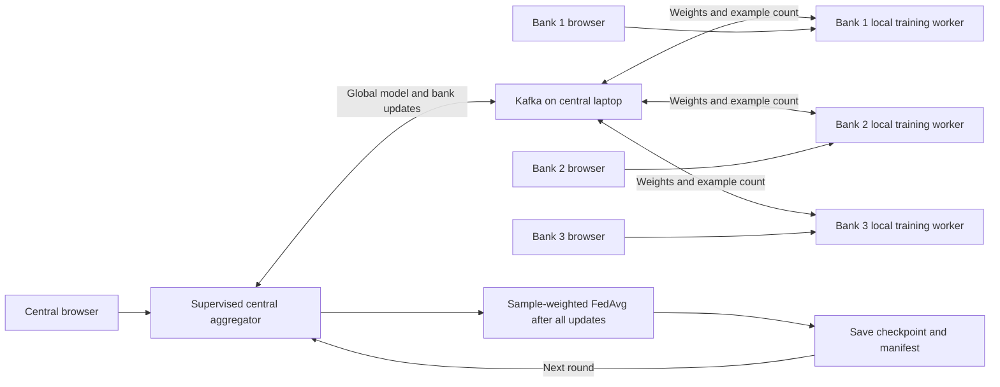

# Federated training and model-streaming dashboard blueprint

Status: planned; documentation only. Updated: 2026-09-27.
Baseline inspected: `1294588780ddef3512910accce3b0fc48ee655f4`.
Training behavior reference: `Anshul-feat/modelSharing`; corresponding local aggregator, worker, and runtime modules must remain behaviorally compatible.

## 1. Objective and scope

Provide a browser interface and platform launchers for the existing distributed federated-training pipeline. After initial setup, users configure their role and data, check readiness, start workers, and operate training runs without copying terminal commands or maintaining an Ubuntu VM.

**Training orchestration is in scope; preserve the existing learning behavior.** Central broadcasts the same model to all configured banks. Each bank trains locally and returns its weights and training-example count. Central waits for all banks, performs sample-weighted FedAvg, saves a checkpoint and manifest, and starts the next round. Sequential bank training and aggregation over a subset of banks are outside this scope. Bank identities map to the configured bank datasets.

Reuse the existing model runtime, local training function, and FedAvg implementation. Lifecycle, progress, and recovery adapters may modify federation entry points while preserving model architecture, preprocessing semantics, optimizer behavior, seed semantics, and default parameters. Do not overwrite frozen research results or reference checkpoints. Successful delivery alone does not prove model compatibility or training completion.

The first release supports:

- Supervised startup of Kafka, the central aggregator, and bank workers.
- Dataset/schema setup, validated initial-model selection, and configuration of existing training parameters.
- Automatic broadcast, local training, update return, validation, aggregation, and checkpoint saving across multiple rounds.
- Readiness checks, measured progress, persistent run history, controlled stopping, and explicit recovery.
- Windows and macOS laptops, with an optional Linux development environment.

## 2. What exists and what must be built

| Component | Current evidence | Planned use |
|---|---|---|
| `distributed_federation/central/aggregator.py` | Broadcast, wait for all clients, validate updates, sample-weighted FedAvg, checkpoint saving | Core central backend; add supervision, structured events, and durable recovery |
| `distributed_federation/client/bank_worker.py` | Receive global model, train assigned bank, return weights/count/loss | Core bank backend; add readiness, progress, stopping, and persisted updates |
| `distributed_federation/common/model_runtime.py` | Shared encoders/schema, local training, safetensors, model validation, FedAvg | Reuse learning behavior and compatibility checks |
| `distributed_federation/common/protocol.py` | JSON envelopes, Base64 chunks, HMAC-SHA256, payload SHA-256, out-of-order assembly and duplicate checks | Reuse through a streaming adapter; preserve existing training protocol behavior |
| `distributed_federation/common/kafka_io.py` | Producer delivery callbacks, idempotent producer configuration, manual consumer commits | Reuse transport primitives; expose structured progress through a separate adapter |
| `distributed_federation/tools/weight_smoke_test.py` | Central-to-bank file-byte transfer without model loading | Optional transport diagnostic; not the training backend |
| `distributed_federation/kafka/compose.yaml` | Existing Kafka infrastructure | Reference for a separate streaming Compose deployment |
| Existing preflight | Federation runtime checks | Present independent data/model/network readiness checks in the UI |
| Dashboard, launchers, persistent run state, event outbox, automated recovery | Not implemented in the inspected baseline | New work; checkpoint files alone do not provide crash recovery |

The smoke-test receiver currently reconstructs bytes, checks the hash and size, prints success, and exits. It does **not** save those bytes to a file or send central a receipt. Producer delivery confirms broker acceptance, not that a bank received and saved the file.

No dashboard, image, launcher, or automated cross-platform deployment is delivered by this blueprint.

## 3. Target user journey

### First use on each laptop

1. Install and start Docker Desktop with Linux containers. Install ZeroTier on the host, join the team network, and have the network owner authorize the laptop.
2. Clone the repository and open the platform launcher.
3. Choose Central or Bank. Enter the central host's reachable private address; banks also enter their assigned client ID.
4. Central creates a team configuration and per-bank enrollment packages. Each bank imports only its own package through its local dashboard. Packages contain credentials and must be shared privately.
5. Save configuration, then run Check connections. The dashboard explains any failure and the required action.
6. Configure the required dataset location and client-to-bank mapping. Use a launcher folder-selection flow to manage read-only Docker mounts, or a supported local import flow; a browser picker alone cannot configure arbitrary host mounts.
7. Central selects a compatible initial checkpoint or explicitly chooses seeded initialization. Review required banks, rounds, local epochs, and existing training settings, then check data/model/worker readiness.

Docker installation, virtualization enablement, network authorization, OS firewall permissions, and first-launch OS trust prompts may require a person. The app guides those steps; it does not silently change host security settings.

### Normal use

Open launchers → bank applications prepare and enable workers → central checks readiness → Start run → monitor banks and rounds → view/download checkpoints and manifests.

Enabled workers receive models, train, and return updates automatically. Teammates do not open separate terminals or select a file each round. Each laptop must remain awake with its application running. Closing a browser tab does not stop the backend run; reopening reconnects to existing state.

### Dataset and shared-schema prerequisites

The current `prepare_runtime` fits shared encoders using configured `schema_banks`, then builds the selected bank's data. Central also initializes this dataset-dependent runtime using the first configured bank. Document and provision the files required by this existing behavior on every machine; do not promise that central needs no data or that each bank needs only its own files.

If strict local-bank-only data is required, separately design a shared encoder/schema artifact and central initialization path with equivalence tests. Do not silently change preprocessing for packaging. Matching schema hashes alone must not be assumed to prove identical fitted encoder values. Model messages must not carry raw datasets.

## 4. Deployment and networking

Use a small Python/FastAPI service with plain HTML, CSS, and JavaScript. Each machine serves its own dashboard on a loopback-only host port. Server-sent events or polling expose structured status. SQLite and a persistent file directory are sufficient; no separate database server is needed.

| Machine | Containers | Persistent contents |
|---|---|---|
| Central | Dashboard/backend supervising aggregator; Kafka in KRaft mode; topic initializer | Settings, credentials, run/round state, accepted updates, checkpoints/manifests, events, Kafka data |
| Bank | Dashboard/backend supervising bank worker | Settings, own credentials, run state, frozen received models, completed updates, events |

The host launcher owns Docker Compose startup, readiness waiting, diagnostics, and browser opening. The web service does not receive the Docker socket. Central startup must support a setup-only dashboard before Kafka is configured: the host launcher reads saved settings and starts Kafka once the central address is available. Address changes require a guided service restart.

Use published ports and a normal Compose bridge network; do not depend on host networking. Containers on central use Kafka's internal listener. Remote banks bootstrap through the central host's private address and published Kafka port. Kafka must advertise that same reachable external address to them; advertising `localhost` or a Compose service name to remote banks will fail.

ZeroTier runs on the host. Verify routing from inside the bank containers, not just host-to-host ping. Restrict the published broker port to the intended private network using a supported host binding/firewall arrangement, and test that arrangement on both platforms. Do not expose dashboards or the broker through public router port forwarding.

Target native `linux/amd64` images for Windows Intel/AMD and Intel Macs, and `linux/arm64` images for Apple Silicon. Validate Kafka, PyTorch, graph-learning dependencies, and dataset access on both architectures before promising support. Windows ARM is outside the first acceptance matrix. Preserve CPU training initially; measure RAM, disk, and training duration on representative laptops. GPU support is not required initially.

Run training in supervised background processes so API requests stay responsive. Start only known entry points with validated arguments. Prevent duplicate aggregator/worker instances and allow one active run per local application initially. The launcher manages dataset mounts and guided restarts; the backend must not expose arbitrary command execution.

Docker Desktop manages virtualization internally; this removes the team's manually administered Ubuntu VMs, not virtualization itself.

Start with reproducible local image builds. Publish versioned multi-architecture images only after validation and an explicit release decision. Pin tested dependencies/image versions at implementation time; record the application version and protocol version in each transfer manifest.

## 5. Training and streaming architecture


```mermaid
flowchart LR
    CU[Central browser] --> CS[Supervised central aggregator]
    CS <-->|Global model and bank updates| K[Kafka on central laptop]
    K <-->|Weights and example count| B1[Bank 1 local training worker]
    K <-->|Weights and example count| B2[Bank 2 local training worker]
    K <-->|Weights and example count| B3[Bank 3 local training worker]
    CS --> A[Sample-weighted FedAvg after all updates]
    A --> S[Save checkpoint and manifest]
    S -->|Next round| CS
    U1[Bank 1 browser] --> B1
    U2[Bank 2 browser] --> B2
    U3[Bank 3 browser] --> B3
```

Reuse the existing training topics and message types. Kafka transports messages; the central aggregator updates the model. Add versioned control/status topics for the dashboard:

| Proposed topic | Purpose |
|---|---|
| Existing configured global topic, normally `fcl.global-model` | Same global model for every bank; `global_model` chunks |
| Existing configured update topic, normally `fcl.client-updates` | Trained bank weights and metadata; `client_update` chunks |
| Proposed `fcl.streaming.control` | Run announcements, readiness challenges, stop/recovery commands |
| Proposed `fcl.streaming.events` | Authenticated readiness, progress, model receipts, update acceptance, checkpoint completion, errors |

Preserve real `run_id`, `round_id`, and model-schema semantics. Transport attempt identifiers are separate fields, not substitutes for training identities. Extend protocol metadata with compatibility checks where necessary. New control/event handlers must exist before the UI claims those capabilities.

Every bank uses a separate consumer group to receive the full central transfer. Central consumes upstream files and events. A single backend worker owns each local consumer; browser refreshes must not create additional Kafka consumers.

Preserve sender identity, run/round, schema hash, base-model hash, payload hash, chunk count, and training-example count; updates also report mean training loss. Record application/protocol versions and attempt identity. Freeze model/update payloads before hashing and sending so retries cannot change their contents.

### Round sequence

1. Freeze configuration and required bank membership. Validate data/schema/model, resources, identities, and authenticated readiness of every bank.
2. Central freezes, hashes, signs, chunks, and broadcasts one global model payload to all banks.
3. Banks verify signatures, run/round, hash/size, schema, tensor keys/shapes/dtypes, and finite values before loading the model.
4. Each bank executes the existing local training function on its assigned data and emits measured progress.
5. Each bank freezes and returns its trained weights, positive training-example count, mean loss, and identifying metadata.
6. Central validates and durably accepts one update per configured bank for that round. Reject wrong-base, stale, incompatible, or conflicting updates. Duplicate delivery must not increase contribution.
7. After every required bank is accepted, central calls the existing sample-weighted FedAvg function, saves the checkpoint and manifest, and commits round completion durably.
8. Only then report Round complete and broadcast the saved result for the next round. Record input/output hashes, per-bank counts/losses/update hashes, configuration, and versions.

A broker acknowledgment proves publication only. Distinguish bank model receipt, training completion, central update acceptance, and completed checkpoint saving. No intermediate stage may appear as a completed training round.

### Sample-weighted FedAvg

For floating-point tensors, `global_next = sum((n_i / sum(n_j)) * bank_weights_i)`. The existing worker reports `n_i` as the length of its training stream, not a count multiplied by local epochs. Counts of 1,000 and 3,000 give contributions of 25% and 75%. Preserve the existing requirement that non-floating tensors agree across banks.

Counts affect aggregation weight, not transfer priority or Kafka routing. Preserve their authenticated association with the update; do not replace them with equal weights or user-editable contribution percentages. Authentication does not independently prove a bank's claimed dataset size.

### Durable delivery and saving

Persist frozen payloads, validated updates, acceptance receipts, and retryable event/outbox records. Commit consumer offsets only after corresponding recoverable state is durable. Write files through temporary paths and atomic rename without overwriting unrelated files. Checkpoint and manifest writes need a durable commit record and startup reconciliation so a crash between writes cannot create a false completed round. Existing checkpoint files alone do not implement these guarantees.

## 6. Dashboard

| Screen | Controls and evidence |
|---|---|
| Setup | Role, client-to-bank mapping, enrollment, broker address, dataset location, resource/storage status |
| Readiness | Kafka/topics/listeners, authenticated workers, last seen, data/schema/model compatibility |
| Central run configuration | Initial checkpoint or seeded initialization, required banks, rounds, existing training parameters and timeout; freeze on start |
| Bank worker | Enable worker for configured run, assigned data, receiving/training/uploading state, measured progress and loss |
| Live run | Round, per-bank bytes/chunks/count/loss, accepted and missing updates, contribution fractions, aggregation and saving |
| History | Run/round outcomes, attempts, model lineage/hashes, checkpoint and manifest downloads |
| Diagnostics | Plain-language error, recommended action, expandable redacted logs, exportable diagnostic report |

Use actual counts rather than animated estimates. Separate transfer and training progress; instrument epoch/batch progress before displaying it. Show stale information with timestamps. Training loss is not an evaluation score. Fraud scoring and evaluation screens are outside the initial scope.

Bank updates return automatically after training. The central dashboard exposes Start run, Stop after current round, Cancel run, and validated recovery actions; a manual file-send action is not the normal workflow.

## 7. Checks and failure behavior

Check connections should report each check independently:

- Host launcher: Docker daemon, Compose availability, image architecture, ports, available storage, and service readiness.
- Service: valid configuration, unique known client identity, writable persistent storage, allowed file size, Kafka metadata and advertised-address reachability.
- Peer handshake: fresh signed challenge/response proving that both sides can communicate with the configured credentials. Secret presence or length alone is insufficient.
- Runtime: required data and mounts, matching preprocessing/schema, model dependencies, writable outputs, positive training-example counts, and adequate memory.
- Run gate: all configured banks are enabled for the same frozen configuration, model and limits agree, and no conflicting run is active.

Bank states: Waiting → Receiving → Validating → Training → Publishing update → Update accepted. Central round states: Broadcasting → Waiting for updates → Aggregating → Saving → Complete. Terminal alternatives: Failed, Timed out, Cancelled, Interrupted. Record transport attempts separately from round state.

Preserve wait-for-all behavior. An offline bank, failed worker, or timeout prevents aggregation and round advancement; report missing updates and never silently use a subset. Timeouts must account for training duration. Changing bank membership or configuration requires a new run.

Transport retries resend the same frozen payload with a new transport attempt ID linked to the logical update. They must not retrain a bank or apply its update twice. Partial byte resume is deferred. Reject stale attempts and expired control messages; completed banks remain visible.

After restart, restore history and mark unfinished work Interrupted until reconciliation. Reconcile durable updates, receipts, and checkpoint commits before resending or aggregating. Persist outbox records to recover notification after saving. Do not claim Kafka provides end-to-end exactly-once training or checkpoint delivery.

Resume from the last committed global checkpoint, retaining original configuration, client ordering, logical round number, and seed semantics. Persist the initial model as round-zero recovery input. Do not relabel a resumed round as round 1. Reuse completed updates only when run/round, configuration, schema, and base hash match. If training was interrupted, restart that local round from its frozen global model; mid-epoch optimizer recovery is deferred. Ensure no previous worker still owns the run. Recovery requires new state handling; simply rerunning the existing CLI is insufficient.

Stop after current round saves a complete round and prevents the next broadcast. Cancel run requests cooperative stopping at safe training boundaries and stops advancement. It cannot retract Kafka messages or undo committed checkpoints. Mark cancelled runs inactive so late updates cannot trigger aggregation; retain completed results and diagnostic evidence. An unreachable worker remains unconfirmed, not falsely marked stopped.

Normal shutdown/restart preserves volumes, keys, history, and received files. Changing broker address or credentials is an explicit settings operation; rebooting must not rotate keys. Use bounded retry/backoff, file-size limits, chunk-count limits, per-peer pending-transfer limits, and cleanup of expired partial files. Initial payload ceiling: no higher than the existing assembler's 100,000,000-byte limit; enforce it before upload and at every receiver.
Also enforce the ceiling before model publication. Preserve committed checkpoints and required recovery inputs during cleanup.

## 8. Credentials and files

Use safetensors for network payloads and validated uploaded initial models. The legacy runtime supports trusted repository `.pt`/`.pth` checkpoints with pickle-enabled loading; do not expose unrestricted browser uploads to this path. A copied upload does not become trusted by being placed inside the repository. Any supported legacy checkpoint must be explicitly trusted and provisioned, with tensor/schema validation.

Keep dataset mounts read-only and model outputs separate from frozen artifacts. Model topics do not transport datasets. Document the shared-schema provisioning requirement in section 3 rather than claiming strict local-data isolation unsupported by the current runtime.

Retain the prototype's HMAC/hash approach and private-network trust model. Central has the central signing secret and per-bank secrets; each bank gets the central verification secret and its own secret. Use bank-specific credentials for readiness and receipts. Sign all control/event records, validate identity and freshness, and redact credentials from logs and diagnostic exports.

A shared central HMAC secret authenticates membership in the trusted team; any holder can also forge a central signature. HMAC does not encrypt payloads. Logical recipients and topic names are not access-control boundaries, and bank files should not be described as confidential from other trusted broker participants. Broker ACLs/TLS or asymmetric signatures are separate future hardening work, not claims of this release.

Use backend-managed file IDs, generated storage names, and path containment checks. Never trust a sender-supplied path. Keep uploads and received files away from source code and frozen artifacts. Bound upload size and aggregate disk usage. Downloads are served only through the local application.

Keep credentials outside Git and images. Protect the loopback web API with a local session token and same-origin/CSRF checks for mutations; do not provide arbitrary shell execution endpoints. Enrollment export is per bank and must not reveal other bank secrets. The UI masks keys after entry.

## 9. Proposed implementation surface

All names below are proposed, not existing entry points:

```text
streaming/
  app/                 API, process supervisor, run state, events, recovery
  web/                 Static dashboard
  config/              Non-secret example settings and validation schema
  Dockerfile           Dashboard and federation/ML runtime dependencies
  compose.yaml         Central/bank service definitions
  requirements.txt     Dashboard dependencies and pinned runtime integration
launchers/
  Start-Streaming.cmd
  Start-Streaming.ps1
  Start-Streaming.command
tests/streaming/        Transport, training lifecycle, persistence, API, integration
docs/STREAMING_BLUEPRINT.md
```

Keep settings, credentials, SQLite state, and managed files in ignored storage or persistent volumes. Integrate the existing aggregator, worker, runtime, configuration, and transport helpers; do not duplicate training or FedAvg inside the web layer. Add structured progress, lifecycle controls, and durable recovery behind compatible entry points. Preserve existing defaults and learning behavior with regression coverage. Developer CLI operation remains available.

Windows and macOS launchers should resolve their own directory, handle spaces/non-ASCII paths, reuse an existing service, and open the dashboard after readiness. macOS execution permissions and OS trust prompts require explicit packaging tests; no bypass of OS protections. Developer CLI fallback may exist, but routine user documentation should describe UI actions.

## 10. Milestones and acceptance gates

| Milestone | Deliverable | Gate |
|---|---|---|
| 0 — Blueprint | Scope, architecture, documentation consolidation | This document reviewed; no runtime changes |
| 1 — Supervised pipeline | Existing aggregator/worker integration, events, durable round state | Same base model at all banks; correct FedAvg and saved checkpoint |
| 2 — Containers and checks | ML packaging, data mounts, enrollment, readiness | One central and three logical banks complete multiple rounds locally |
| 3 — Dashboard and recovery | Setup, run controls, status, checkpoints, stop/retry/resume | Normal workflow needs no typed commands; recovery tests pass |
| 4 — Platform launchers | Windows and macOS launch flows | Fresh-host checklist passes on both target architectures |
| 5 — Team demonstration | Real multi-laptop training | Three banks train and return updates; central saves and starts the next round; failure tests pass |

Acceptance must include a small file and a multi-chunk weight file; wrong credentials; missing broker; unreachable advertised listener; offline recipient; corrupted/conflicting/duplicate/out-of-order chunks; stale attempts; interrupted transfer; disk write failure; and a crash after saving but before receipt delivery. Validate byte-identical recovery, not just log strings.

Test central on Windows with a Mac bank, then central on macOS with a Windows bank. Record actual OS, CPU architecture, Docker/image versions, file sizes, hashes, and outcomes. A local four-container test alone does not establish cross-platform networking support.

Verify unequal example counts produce expected weighted tensors and preserve the existing non-floating tensor rules. All banks must receive the same base model, contribute exactly once, and receive the committed aggregate next round. Compare controlled training/aggregation with the existing pipeline within declared numerical tolerances; byte-transfer integrity must remain exact even if cross-platform training is not bit-for-bit identical.

Include missing banks, invalid counts, wrong schema/base model, malformed/non-finite tensors, worker crashes during training and after publishing, central crashes after accepting updates or between checkpoint/manifest writes, lost receipts, and browser refresh. Confirm no duplicate contribution, false round completion, or incorrect recovery seed/round. Verify both stop modes and rejection of late cancelled-run updates.

Use small controlled datasets and representative multi-chunk model payloads, with measured laptop resource usage. Record configuration/data provenance and runtime versions alongside hashes/outcomes. Keep frozen research results and reference checkpoints unchanged; do not rerun research experiments merely to demonstrate the UI.

## 11. Documentation migration

The old VM/setup/streaming instructions were under `distributed_federation/`, not `docs/`. They describe command-driven federation and repeat machine-specific commands.

The seven migration-only operational guides have been removed to avoid duplicate and outdated instructions. The documentation indexes now link directly to this blueprint and `streaming/README.md` for implemented backend behavior. Earlier substantive guides remain available in [Git history](https://github.com/siaa1308/Capstone/tree/1294588780ddef3512910accce3b0fc48ee655f4/distributed_federation); old branch-relative links to the deleted guides should use that historical location. Retain research reproduction and dataset documentation. The table below records where the former guides' topics belong in the new design.

| Previous guide | Replacement coverage |
|---|---|
| `01_VM_SETUP.md` | First-use prerequisites and cross-platform deployment |
| `02_ZEROTIER_KAFKA_SETUP.md` | Networking, listeners, automatic checks |
| `03_MODEL_WEIGHT_EXCHANGE.md` | Broadcast, local training, update return, FedAvg, checkpoints |
| `04_RESTART_AND_RECOVERY.md` | Run/round recovery, stopping, retries, persistence |
| `CENTRAL_PRE_RUN_CHECKLIST.md` | Data/model/worker readiness and run gates |
| `QUICKSTART.md` | Target user journey; no runnable launcher claimed yet |
| `TEAMMATE_WEIGHT_STREAMING.md` | Bank enrollment, dataset setup, worker operation |
| `distributed_federation/README.md` | Short component index and scope boundary |

Once the implementation passes acceptance, add a concise `STREAMING_USER_GUIDE.md` with screenshots and verified platform instructions. Until then, this blueprint is the source of truth for the proposed work, not an executable quickstart.

## 12. Platform references

Consult current official requirements during implementation rather than freezing installer commands here:

- [Docker Desktop on Windows](https://docs.docker.com/desktop/setup/install/windows-install/)
- [Docker Desktop on macOS](https://docs.docker.com/desktop/setup/install/mac-install/)
- [Docker Desktop networking](https://docs.docker.com/desktop/features/networking/)
- [ZeroTier network setup and authorization](https://docs.zerotier.com/start/)
